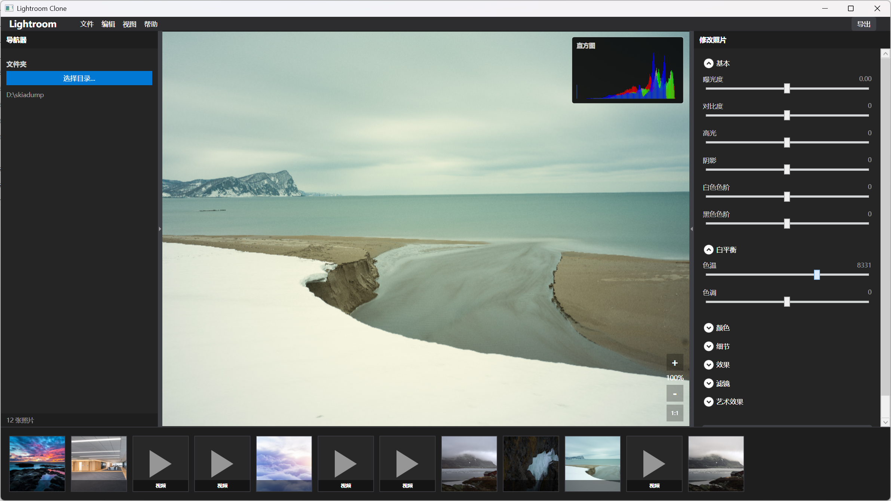

# Lightroom Clone Framework

A Lightroom-like image editing application prototype featuring WPF frontend and C++ backend SDK with GPU-accelerated rendering.

## Features

- **GPU-Accelerated Rendering**: DirectX 11 based rendering pipeline with D3D11 to D3D9 interop for WPF display
- **Modular Architecture**: Separated rendering nodes (Scale, Brightness/Contrast, Passthrough) for flexible image processing
- **Aspect Ratio Preservation**: Automatic letterbox/pillarbox handling to maintain image aspect ratio
- **Zoom & Pan Support**: Interactive zoom and pan controls with real-time rendering
- **Folder Browsing**: Select folders and browse images as thumbnails in filmstrip view
- **RHI Abstraction Layer**: High-level rendering interface for DirectX 11 operations

## Screenshots

### Main Application Window



The main window features:
- **Left Panel**: Folder selection and image count display
- **Center Panel**: Image editor with GPU-accelerated rendering, zoom controls, and aspect ratio preservation
- **Bottom Panel**: Filmstrip view showing thumbnails of all images in the selected folder
- **Right Panel**: Image adjustment controls (brightness, contrast, etc.)

## Project Structure

```
lightroom/
├── src/
│   ├── Lightroom.App/          # WPF UI Application (C#)
│   │   ├── Controls/           # UI Controls (LeftPanel, ImageEditorView, FilmstripView, etc.)
│   │   └── Core/                # P/Invoke wrappers
│   └── Lightroom.Core/          # Image Processing SDK (C++)
│       ├── d3d11rhi/            # DirectX 11 RHI abstraction layer
│       ├── RenderNodes/          # Rendering nodes (Scale, BrightnessContrast, Passthrough)
│       ├── D3D9Interop.*         # D3D11 to D3D9 interop for WPF D3DImage
│       ├── ImageProcessor.*      # Image loading using WIC
│       ├── RenderGraph.*         # Render graph management
│       └── RenderTargetManager.* # Render target lifecycle management
├── screenshot/                   # Application screenshots
└── LightroomClone.sln          # Visual Studio solution file
```

## Architecture

### High-Level Architecture

```
┌─────────────────────────────────────────────────────────┐
│                    WPF Application                       │
│  (User Interface, Controls, Event Handling)             │
└────────────────────┬────────────────────────────────────┘
                     │ P/Invoke
┌────────────────────▼────────────────────────────────────┐
│              Lightroom Core SDK (C++)                    │
│  ┌──────────────┐  ┌──────────────┐  ┌──────────────┐  │
│  │ Image        │  │ Render      │  │ D3D9        │  │
│  │ Processor    │→ │ Graph       │→ │ Interop     │  │
│  │ (WIC)        │  │ (Nodes)     │  │ (WPF)       │  │
│  └──────────────┘  └──────────────┘  └──────────────┘  │
│         │                  │                  │         │
│         └──────────────────┴──────────────────┘         │
│                          │                              │
│              ┌───────────▼───────────┐                 │
│              │   D3D11 RHI Layer     │                 │
│              │  (Abstraction Layer)  │                 │
│              └───────────┬───────────┘                 │
│                          │                              │
└──────────────────────────┼──────────────────────────────┘
                           │
              ┌────────────▼────────────┐
              │   DirectX 11 API        │
              │   (GPU Rendering)       │
              └─────────────────────────┘
```

### Rendering Pipeline

1. **Image Loading**: WIC (Windows Imaging Component) loads images into D3D11 textures
2. **Render Graph**: Modular rendering nodes process the image
   - `ScaleNode`: Handles scaling, zoom, pan, and aspect ratio preservation
   - `BrightnessContrastNode`: Adjusts image brightness and contrast
   - `PassthroughNode`: Direct copy without processing
3. **D3D11 to D3D9 Interop**: Shared textures between D3D11 and D3D9 for WPF display
4. **WPF Display**: D3DImage displays the final result

## Building the Project

### Prerequisites

- **Visual Studio 2022** with the following workloads:
  - .NET desktop development
  - Desktop development with C++

### Build Steps

1. **Open the Solution**
   ```bash
   # Open LightroomClone.sln in Visual Studio 2022
   ```

2. **Configure C++ Project** (if needed)
   - If the C++ project is not visible in Solution Explorer:
     - Right-click on the solution → **Add → Existing Project**
     - Select `src\Lightroom.Core\Lightroom.Core.vcxproj`
   - Set project dependencies:
     - Right-click `Lightroom.App` → **Build Dependencies → Project Dependencies**
     - Check `LightroomCore` to ensure correct build order

3. **Build Configuration**
   - Select **Debug** or **Release** configuration
   - Select **x64** platform (C++ SDK defaults to x64)
   - Build the solution (F6 or Build → Build Solution)

4. **Run**
   - Set `Lightroom.App` as the startup project
   - Press F5 to run

## Key Technologies

- **WPF (Windows Presentation Foundation)**: Modern UI framework for Windows
- **DirectX 11**: GPU-accelerated rendering
- **DirectX 9 Interop**: Sharing textures with WPF D3DImage
- **WIC (Windows Imaging Component)**: Image format support (JPEG, PNG, etc.)
- **HLSL Shaders**: GPU shaders for image processing
- **P/Invoke**: Interoperability between C# and C++

## Usage

1. **Select a Folder**: Click "Select Folder" in the left panel to browse for image folders
2. **Browse Images**: Thumbnails appear in the bottom filmstrip view
3. **Load Image**: Click a thumbnail to load it into the center editor
4. **Zoom**: Use the +/- buttons or "1:1" button to zoom in/out or fit to window
5. **Adjustments**: Use the right panel to adjust image parameters (brightness, contrast, etc.)

## Technical Highlights

### Aspect Ratio Preservation

The `ScaleNode` automatically maintains image aspect ratio:
- Calculates `FitScale = min(OutputWidth/InputWidth, OutputHeight/InputHeight)`
- Ensures the image fits within the viewport without distortion
- Automatically adds letterbox (horizontal black bars) or pillarbox (vertical black bars) as needed

### GPU Rendering Pipeline

- **RHI Abstraction**: High-level rendering interface for DirectX 11
- **Render Nodes**: Modular processing units that can be chained together
- **Constant Buffers**: Efficient parameter passing to GPU shaders
- **Shared Textures**: Zero-copy texture sharing between D3D11 and D3D9

### Code Organization

- **Separation of Concerns**: UI, image processing, and rendering are separated
- **Modular Design**: Each render node is in its own file with a common base class
- **RHI Abstraction**: All DirectX 11 operations go through the RHI layer, not direct API calls

## Future Enhancements

- [ ] Additional image adjustment nodes (exposure, saturation, etc.)
- [ ] Undo/Redo functionality
- [ ] Image export functionality
- [ ] Batch processing support
- [ ] GPU-accelerated filters and effects
- [ ] Support for RAW image formats
- [ ] Multi-threaded image processing

## License

This is a prototype project for educational and research purposes.

## Contributing

Contributions are welcome! Please feel free to submit issues or pull requests.
